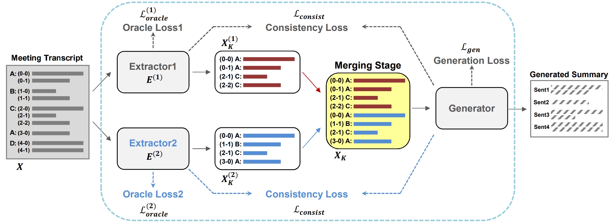

# ExplainMeetSum

This is code for the ACL 2023 paper [ExplainMeetSum: A Dataset for Explainable Meeting Summarization Aligned with Human Intent](https://aclanthology.org/2023.acl-long.731.pdf)

## Table of Contents

* [Prerequsite](#prerequsite)
* [Dataset](#dataset)
  * [Folder Structure](#folder-structure)
  * [Build dataset](#build-dataset)
  * [Dataset Format](#dataset-format)
    * [TLDR;](#tldr)
* [Model](#model)
  * [Dependency](#dependency)
  * [Training](#training)
  * [Evaluation](#evaluation)
  * [Results](#results)
* [Acknowledgements](#acknowledgements)
* [Citation](#citation)

## Prerequsite
```bash
git clone https://github.com/angdong/ExplainMeetSum.git
conda create -n explainmeetsum
conda activate explainmeetsum
```

## Dataset

**ExplainMeetSum** dataset is augmented version of [QMSUM](https://github.com/Yale-LILY/QMSum), by newly annotating **evidence sentences** that faithfully "explain" a summary.

> Note: covid_1.json in QMSum is excluded \
> $\to$ [REASON]

### Folder Structure
```
.
├── QMSum@
├── acl2018_abssumm@
├── SummaryEvidence
│   ├── test
│   ├── train
│   └── val
├── ExplainMeetSum
│   ├── test
│   ├── train
│   └── val
├── convert.py
├── sentence_split.py
└── utils.py
```

### Build dataset
You can build dataset by executing python file.\
Created dataset will be same as [ExplainMeetSum/data/ExplainMeetSum](data/ExplainMeetSum).

```bash
git submodule update --remote
cd ExplainMeetSum
pip install nltk==3.6.2
python data/convert.py

# or you can specify your own path
python data/convert.py \
    --qmsum QMSUM_ROOT_DIRECTORY \
    --dialogue_act ACL2018_ABSSUMM_ROOT_DIRECTORY \
    --save_dir EXPLAIMEETSUM_DIRECTORY
```

### Dataset Format
You can find format of each dataset in [here](data/README.md)

#### TLDR;
##### ExplainMeetSum
ExplainMeetSum data is extended-version of QMSum dataset. To annotate evidence sentence by sentence, we had to split sentences as correctly as we can. Below are our methods how to split sentences

1. meeting transcripts
    * Committee: use `nltk.sent_tokenize()`
    * Academic(ICSI), Product(Ami): use dialogue act files in [ACL2018_AbsSumm](https://bitbucket.org/dascim/acl2018_abssumm/src/master/)
2. answers in query_list (i.e. summary)
    * use `nltk.sent_tokenize()` and merge sentences that splited wrongly (if you want to know, refer to `sentence_split.py`)
    * splited answers are already stored in `data/SummaryEvidence`

##### QMSum
ExplainMeetSum data should also contain `meeting_transcripts` which doesn't exist in `data/SummaryEvidence`.\
So, you need original QMSum/ dataset.

##### ACL2018_AbsSumm
We splited `meeting_transcripts` of ICSI and Ami dataset in QMSum by using dialogue act files.\
So, you need acl2018_abssumm/ for dialogue act files.

## Model
> _To be written_



### Dependency
Install dependencies via:
```
conda create -n explainmeetsum python=3.9.6
conda activate explainmeetsum

# below are depends on your envs
conda install pytorch==1.8.0 torchvision==0.9.0 torchaudio==0.8.0 cudatoolkit=11.1 -c pytorch -c conda-forge

pip install nltk==3.6.2 pyrouge==0.1.3 transformers==4.8.1 rouge==1.0.0 datasets==1.11.0
```

### Training
First download the checkpoint of DYLE's `best-generator.ckpt` from [Google Drive](https://drive.google.com/drive/folders/1Zz97kORSWvK6VU1leCyOFQnlijJRI8HG).\
Place the ckpt file under `MultiDyle/dyle/`

```
sh train_multi_dyle.sh
```
With one NVIDIA RTX A6000, spent about **2h per epoch**.\
You can see other results by editing `config.py`.

### Evaluation
First download the checkpoints of Multi-DYLE from [Google Drive](https://drive.google.com/drive/u/2/folders/1IL9NoqsQbhzk-ALg2_BJXZBgznKOW5Zv).\
Place the folder under `MultiDyle/outputs/multidyle-best-model/`
```
sh test_multi_dyle.sh
```
Results will be same as table below.\
You can see other results by editing `config.py`.

### Results

|Model||R-1|R-2|R-L|
|-|-|-|-|-|
|$\text{Multi-DYLE}(\mathsf{X^{ROG}_o}, \mathsf{X^{CES}_o})$||**37.55**|**12.43**|**32.76**|

* ($\mathsf{X^{ROG}_o}, \mathsf{X^{CES}_o}$) : Train with sentence-level ROUGE-based and CES-based extractive oracles.

## Acknowledgements
Dataset named ExplainMeetSum is extended-version of QMSum([https://github.com/Yale-LILY/QMSum](https://github.com/Yale-LILY/QMSum)) for "[QMSum: A New Benchmark for Query-based Multi-domain Meeting Summarization](https://arxiv.org/pdf/2104.05938v1.pdf)", which distributed under MIT License Copyright (c) 2021 Yale-LILY.

Model named Multi-DYLE is extended-version of DYLE([https://github.com/Yale-LILY/DYLE](https://github.com/Yale-LILY/DYLE)) for "[DYLE: Dynamic Latent Extraction for Abstractive Long-Input Summarization](https://arxiv.org/pdf/2110.08168.pdf)", which distributed under MIT License Copyright (c) 2021 Yale-LILY.

## Citation
If you extend or use our work, please cite the [paper](https://aclanthology.org/2023.acl-long.731.pdf)

```bibtex
@inproceedings{kim-etal-2023-explainmeetsum,
    title = "{E}xplain{M}eet{S}um: A Dataset for Explainable Meeting Summarization Aligned with Human Intent",
    author = "Kim, Hyun  and
      Cho, Minsoo  and
      Na, Seung-Hoon",
    booktitle = "Proceedings of the 61st Annual Meeting of the Association for Computational Linguistics (Volume 1: Long Papers)",
    month = jul,
    year = "2023",
    address = "Toronto, Canada",
    publisher = "Association for Computational Linguistics",
    url = "https://aclanthology.org/2023.acl-long.731",
    doi = "10.18653/v1/2023.acl-long.731",
    pages = "13079--13098",
}

```
